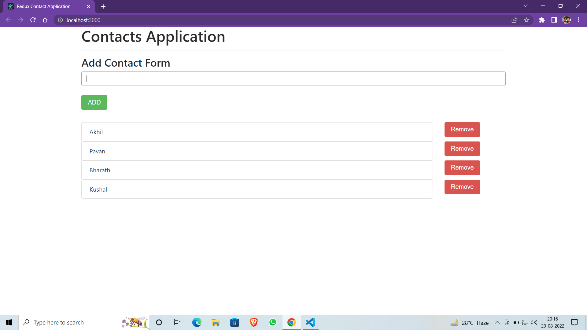

# Contacts-App

<!-- ctrl+shift+v : preview -->


- [Description](#description)
- [How To Use](#how-to-use)

### Description
- User can add, delete the contacts.
- Mainly focused on using react-redux.

#### Technologies

- React, Redux and useState react hook
- HTML

---
#### Installation
```bash
    Use a command Prompt and type : npm install or npm i
```

## How To Use

run the server

### `npm start`

Runs the app in the development mode.\
Open [http://localhost:3000](http://localhost:3000) to view it in your browser